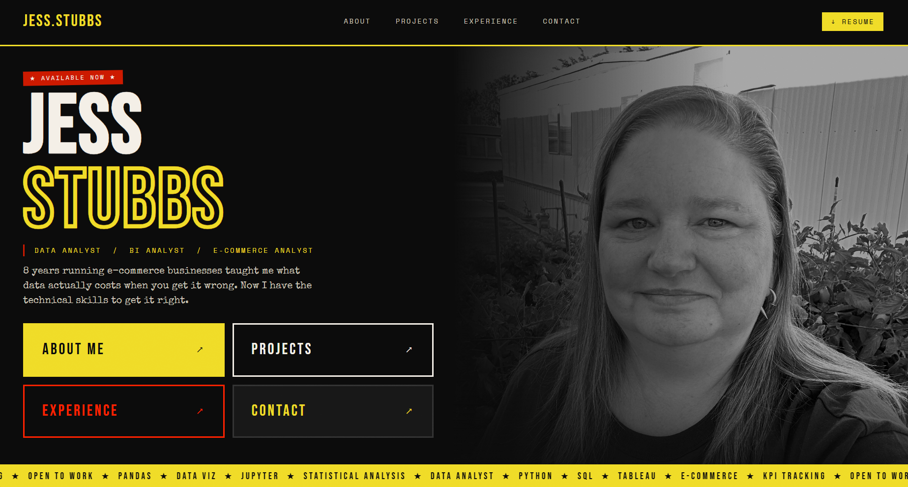

# Jessica Stubbs | Data Analyst Portfolio

Professional portfolio website showcasing my work as a Data Analyst.

---

## Folder Structure
```bash
portfolio-website/
├─ index.html
├─ about.html
├─ projects.html
├─ experience.html
├─ contact.html
├─ jess-stubbs-resume.pdf
├─ images/
│  └─ me_photo.jpg
├─ projects/
│  ├─ project1.html
│  ├─ project2.html
│  └─ images/
│     ├─ project1.png
│     └─ project2.png
└─ styles/
   └─ main.css
```
---

## Pages

- **index.html** – Homepage
- **about.html** – About Me
- **projects.html** – Projects overview
- **projects/project1.html** – Individual project page
- **projects/project2.html** – Individual project page
- **experience.html** – Career experience
- **contact.html** – Contact form
- **jess-stubbs-resume.pdf** – Downloadable resume

---

## Features

- Responsive design
- Hero section with animated effects
- Multi-page project showcase
- Navigation between pages
- Resume download link

---

## Site Preview



---

## Getting Started

```bash
git clone https://github.com/your-username/portfolio-website.git
cd portfolio-website
open index.html
